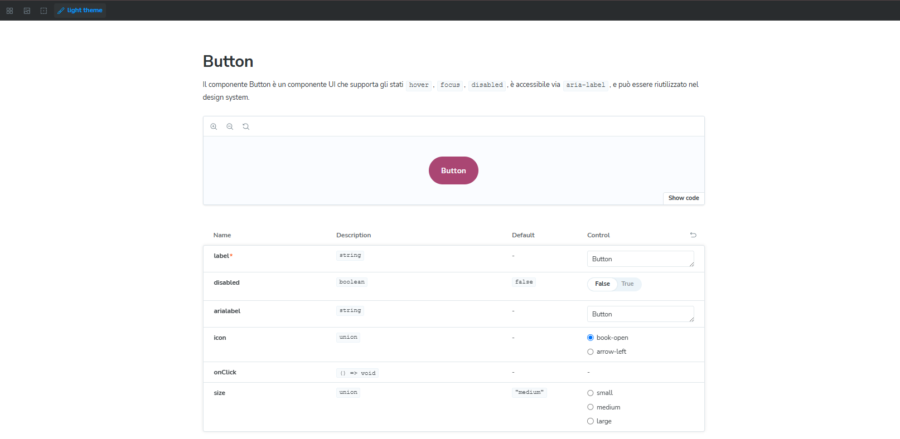
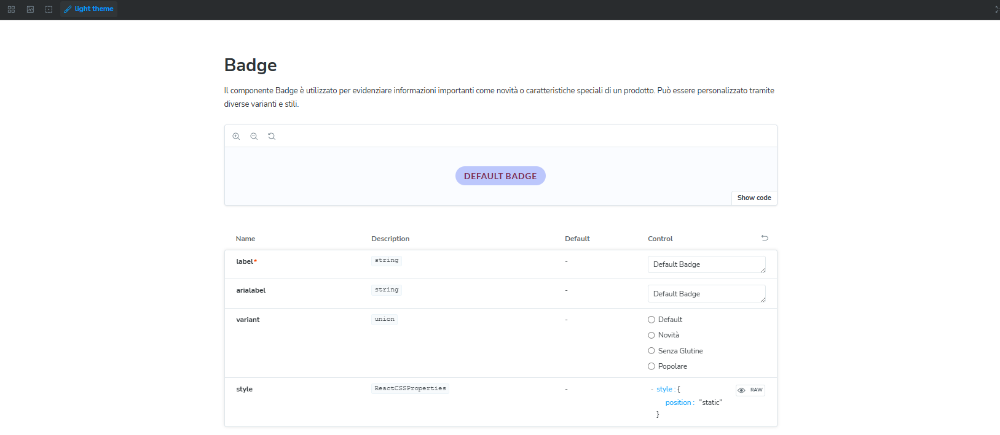
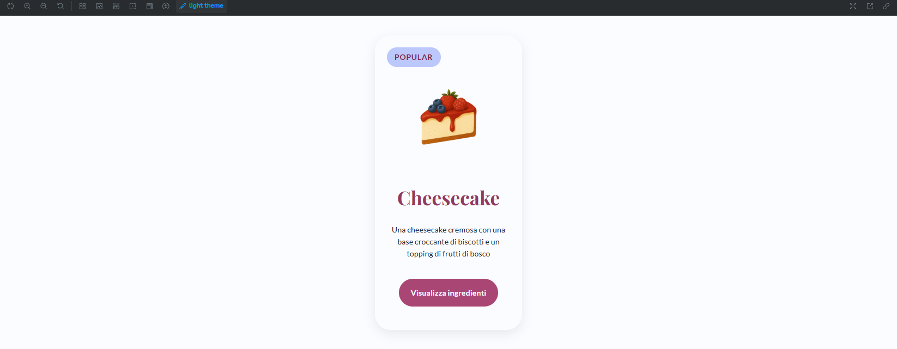
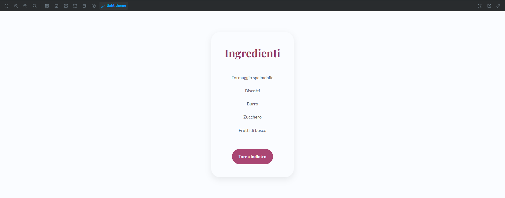
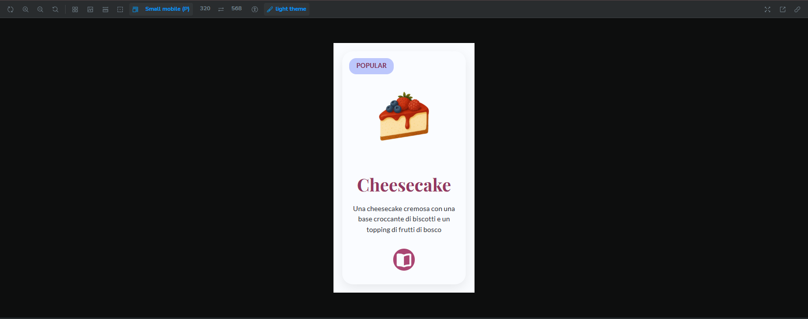
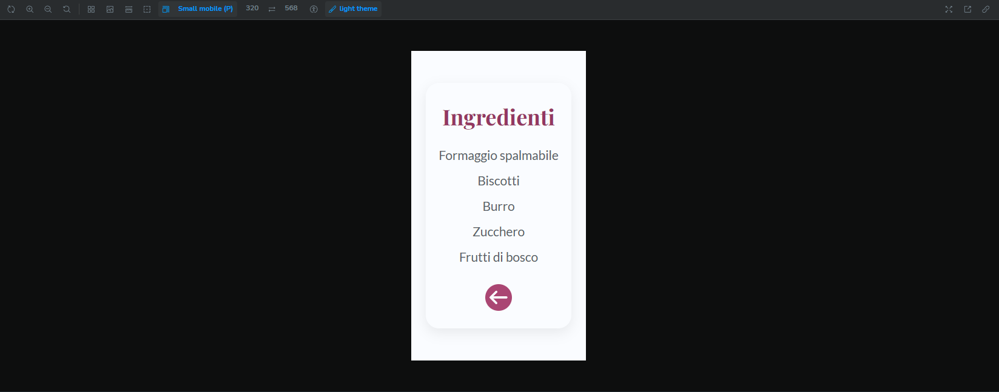

# 🧁 Webdesign Card Component Patisseriè

Il seguente componente di design prende ispirazione per un ipotetico blog che pubblica ricette di dolci. Questa repository contiene tre **componenti UI personalizzati** di cui fanno parte il Bottone, i Badge e la Card, che comprende entrambe le facciate (fronte e retro).

---

## 🚀 Tecnologie utilizzate


---

## 📦 Contenuto

- ✅ Componenti `Card` , `Button` , `Badge` riutilizzabili
- 🎨 Palette di colori custom basata su variabili CSS (`--gray`, `--pink`, `--lilac`)
- 🧩 Varianti/stati: `default`, `hover`, `focus`, `disabled`, `new`, `popular`, `gluten free`
- 🌙 Tema chiaro/scuro
- 💬 Tono di voce e testo coerenti (UX writing)
- 👓 Color Contrast Checker (WCAG AAA)
- ⚙️ Documentazione interattiva via Storybook

## 🎨 Componenti disponibili

### 1. **CardFront**

- **Cupcake**: card della ricetta di un cupcake alla fragola con immagine, titolo prodotto, descrizione, badge di un prodotto "new" e bottone "Vedi ingredienti"
- **Dolcetti al cocco**: card della ricetta dei dolcetti al cocco con immagine, titolo prodotto, descrizione, badge di un prodotto "gluten free" e bottone "Vedi ingredienti"
- **Cheesecake**: card della ricetta di una cheesecake con immagine, titolo prodotto, descrizione, badge di un prodotto "popular" e bottone "Vedi ingredienti"

### 1a. **CardBack**

- Retro delle ricette della card, dove vengono mostrati gli ingredienti per la preparazion e con il bottone "torna indietro" per tornare alla card frontale.

### 2. **Button**

Con supporto agli stati:

- **Default**
- **Hover**
- **Focus**
- **Disabled**

### 3. **Badge**

- Etichetta personalizzabile
- Varianti: `new`, `gluten free`, `popular`

---

## 🎨 Palette di colori e il loro significato

La palette è costruita con tre famiglie principali: **Grigi**, **Rosa Zucchero** e **Lilla Crema**, più variabili per il supporto **light/dark mode**.

### ⚪ Grigi (Colore sfondo card)

- **Significato**: neutralità, equilibrio, leggibilità
- **Ruolo in UI**: forniscono contrasto con colori primari e CTA, usato per lo sfondo della card e gestiscono stati disabled

### 🌸 Rosa Zucchero (colore CTA / Testi )

- **Significato**: dolcezza, accoglienza, positività
- **Ruolo in UI**: utilizzato per i bottoni primari e i testi principali (es. titoli), trasmette un tono amichevole e rassicurante. Supporta testi principali in light/dark mode
- Comunica **empatia e delicatezza**, incoraggiando l’interazione senza risultare invadente. Ideale per un’esperienza utente che vuole sembrare **gentile, accessibile e curata nei dettagli**. Perfetto per brand che vogliono evocare **tenerezza, fiducia e calore umano**.

### 💜 Lilla Crema (Colore badge)

- **Significato**: creatività, sensibilità, eleganza
- **Ruolo in UI**: usato nei badge informativi o decorativi, aiuta a distinguere contenuti speciali (es. “new”, “gluten free”, "popular") mantenendo un tono raffinato.
- Comunica **armonia e equilibrio**, bilanciando la vivacità del rosa con una presenza più calma. Dona **coerenza visiva** alla palette, rendendo l’interfaccia più sofisticata e dolce al tempo stesso.

### 🌗 Light/Dark Mode

- **Significato**: adattabilità, leggibilità, inclusività
- **Ruolo in UI**: mantiene contrasto e leggibilità in modalità chiara o scura, garantisce accessibilità secondo WCAG

---

## 📱 Responsive Design

I componenti sono progettati per adattarsi a diversi schermi, dai desktop ai dispositivi mobile, mantenendo leggibilità e usabilità.

### Card

- `.card-container`
  - **Desktop**: max-width 280px
  - **Mobile (≤480px)**: max-width 100%, font aumentati (`--font-size-h2`), testo leggibile su schermi piccoli

### Bottone (`.pink-btn`)

- **Dimensioni adattive**: small, medium, large
- **Tablet (≤834px)**: font e padding ridotti
- **Mobile (≤320px)**: font ancora più piccolo, padding ridotto, testo nascosto (`.button-text`), icone visibili solo in mobile

### Badge (`.badge`)

- **Tablet e Mobile (≤480px)**: font più piccolo, padding ridotto per adattarsi alle card compatte

## 📖 Documentazione

Tutti i componenti sono documentati con **Storybook**, comprensivi di:

- Varianti di utilizzo
- Palette colori
- Tipografia
- Controlli per le props
- Accessibilità

Per avviare Storybook:

```bash
npm install
npm run storybook
```

## 📸 Screenshot

### BUTTON



### BADGE



### CARD FRONT



### CARD RETRO



### RESPONSIVE CARD FRONT



### RESPONSIVE CARD FRONT


